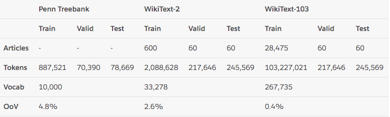
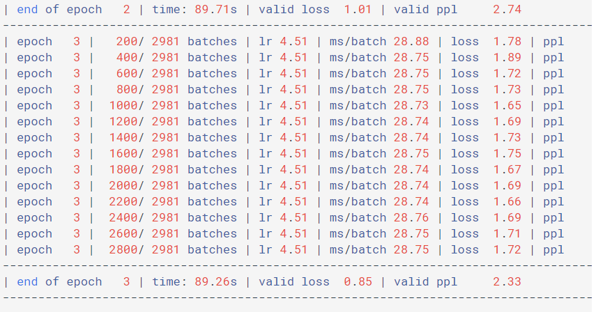

# TransformChartoChar

# 1. 语言模型
* 以一个符合语言规律的序列为输入，模型将利用序列间关系等特征，输出一个在所有词汇上的概率分布.这样的模型称为语言模型.
*语言模型的训练语料一般来自于文章，对应的源文本和目标文本形如:
** src1 = "I can do" tgt1 = "can do it"src2 = "can do it", tgt2 = "do it <eos>"
  
## 1.1 语言模型能解决哪些问题?
* 1, 根据语言模型的定义，可以在它的基础上完成机器翻译，文本生成等任务，因为我们通过最后输出的概率分布来预测下一个词汇是什么.
* 2, 语言模型可以判断输入的序列是否为一句完整的话，因为我们可以根据输出的概率分布查看最大概率是否落在句子结束符上，来判断完整性.
* 3, 语言模型本身的训练目标是预测下一个词，因为它的特征提取部分会抽象很多语言序列之间的关系，这些关系可能同样对其他语言类任务有效果.因此可以作为预训练模型进行迁移学习.

# 2.整个案例的实现可分为以下五个步骤
* 第一步: 导入必备的工具包
* 第二步: 导入wikiText-2数据集并作基本处理
* 第三步: 构建用于模型输入的批次化数据
* 第四步: 构建训练和评估函数
* 第五步: 进行训练和评估(包括验证以及测试)

# 2.1数据集
* 使用wikiText-2来训练语言模型

# 2.2 语言模型训练的语料规定
* 如果源数据为句子ABCD, ABCD代表句子中的词汇或符号, 则它的目标数据为BCDE, BCDE分别代表ABCD的下一个词汇.

# 3. 训练结果

